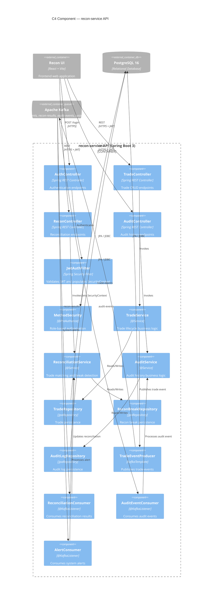

# C4 Component — recon-service API

This diagram zooms into the **recon-service API** container and shows the major Spring Boot components that make up the backend of ReconX.

```mermaid
C4Component
title C4 Component — recon-service API

Container_Ext(reactSpa, "Recon UI", "React + Vite", "Frontend web application")
ContainerDb_Ext(postgres, "PostgreSQL 16", "Relational Database")
ContainerQueue_Ext(kafka, "Apache Kafka", "trade-events, recon-results, audit-events, system-alerts")

Container_Boundary(api, "recon-service API (Spring Boot 3)") {

    Component(authCtl, "AuthController", "Spring REST Controller", "Authentication endpoints")
    Component(tradeCtl, "TradeController", "Spring REST Controller", "Trade CRUD endpoints")
    Component(reconCtl, "ReconController", "Spring REST Controller", "Reconciliation endpoints")
    Component(auditCtl, "AuditController", "Spring REST Controller", "Audit history endpoints")

    Component(jwtFilter, "JwtAuthFilter", "Spring Security Filter", "Validates JWT and populates SecurityContext")
    Component(rbac, "MethodSecurity", "@PreAuthorize", "Role-based authorization")

    Component(tradeSvc, "TradeService", "@Service", "Trade lifecycle business logic")
    Component(reconSvc, "ReconciliationService", "@Service", "Trade matching and break detection")
    Component(auditSvc, "AuditService", "@Service", "Audit history business logic")

    Component(tradeRepo, "TradeRepository", "JpaRepository", "Trade persistence")
    Component(reconRepo, "ReconBreakRepository", "JpaRepository", "Recon break persistence")
    Component(auditRepo, "AuditLogRepository", "JpaRepository", "Audit log persistence")

    Component(tradeProducer, "TradeEventProducer", "KafkaTemplate", "Publishes trade-events")

    Component(reconciliationConsumer, "ReconciliationConsumer", "@KafkaListener", "Consumes reconciliation results")
    Component(auditConsumer, "AuditEventConsumer", "@KafkaListener", "Consumes audit events")
    Component(alertConsumer, "AlertConsumer", "@KafkaListener", "Consumes system alerts")
}

Rel(reactSpa, authCtl, "POST /login", "HTTPS")
Rel(reactSpa, tradeCtl, "REST", "HTTPS + JWT")
Rel(reactSpa, reconCtl, "REST", "HTTPS + JWT")
Rel(reactSpa, auditCtl, "REST", "HTTPS + JWT")

Rel(authCtl, jwtFilter, "Authenticates")
Rel(jwtFilter, rbac, "Sets SecurityContext")

Rel(tradeCtl, tradeSvc, "Invokes")
Rel(reconCtl, reconSvc, "Invokes")
Rel(auditCtl, auditSvc, "Invokes")

Rel(tradeSvc, tradeRepo, "Reads/Writes")
Rel(reconSvc, reconRepo, "Reads/Writes")
Rel(auditSvc, auditRepo, "Reads/Writes")

Rel(tradeRepo, postgres, "JPA / JDBC")
Rel(reconRepo, postgres, "JPA / JDBC")
Rel(auditRepo, postgres, "JPA / JDBC")

Rel(tradeSvc, tradeProducer, "Publishes trade event")
Rel(tradeProducer, kafka, "trade-events")

Rel(kafka, reconciliationConsumer, "recon-results")
Rel(reconciliationConsumer, reconSvc, "Updates reconciliation")

Rel(kafka, auditConsumer, "audit-events")
Rel(auditConsumer, auditSvc, "Processes audit event")

Rel(kafka, alertConsumer, "system-alerts")
Rel(alertConsumer, reconSvc, "Processes alert")
```
