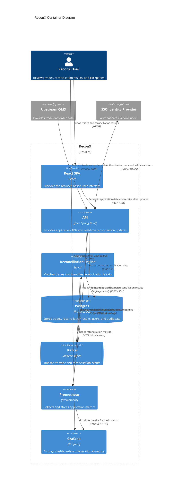

# ReconX C4 Container Diagram

```mermaid
C4Container
title ReconX Container Diagram

Person(user, "ReconX User", "Reviews trades, reconciliation results, and exceptions")

System_Ext(oms, "Upstream OMS", "Provides trade and order data")
System_Ext(sso, "SSO Identity Provider", "Authenticates ReconX users")

System_Boundary(reconxBoundary, "ReconX") {
    Container(spa, "React SPA", "React", "Provides the browser-based user interface")

    Container(api, "API", "Java Spring Boot", "Provides application APIs and real-time reconciliation updates")

    Container(reconEngine, "Reconciliation Engine", "Java", "Matches trades and identifies reconciliation breaks")

    ContainerDb(postgres, "Postgres", "PostgreSQL", "Stores trades, reconciliation results, users, and audit data")

    ContainerQueue(kafka, "Kafka", "Apache Kafka", "Transports trade and reconciliation events")

    Container(prometheus, "Prometheus", "Prometheus", "Collects and stores application metrics")

    Container(grafana, "Grafana", "Grafana", "Displays dashboards and operational metrics")
}

Rel(user, spa, "Views trades and reconciliation results", "HTTPS")

Rel(spa, api, "Requests application data and receives live updates", "REST + SSE")

Rel(api, sso, "Authenticates users and validates tokens", "OIDC / HTTPS")

Rel(oms, api, "Submits trade and order data", "HTTPS / JSON")

Rel(api, kafka, "Publishes incoming trade events", "Kafka protocol")

Rel(kafka, reconEngine, "Delivers trades for reconciliation", "Kafka protocol")

Rel(reconEngine, kafka, "Publishes reconciliation results and exceptions", "Kafka protocol")

Rel(api, postgres, "Reads and writes application data", "JDBC / SQL")

Rel(reconEngine, postgres, "Reads trades and stores reconciliation results", "JDBC / SQL")

Rel(api, prometheus, "Exposes API health and performance metrics", "HTTP / Prometheus")

Rel(reconEngine, prometheus, "Exposes reconciliation metrics", "HTTP / Prometheus")

Rel(prometheus, grafana, "Provides metrics for dashboards", "PromQL / HTTP")

Rel(user, grafana, "Views operational dashboards", "HTTPS")
```